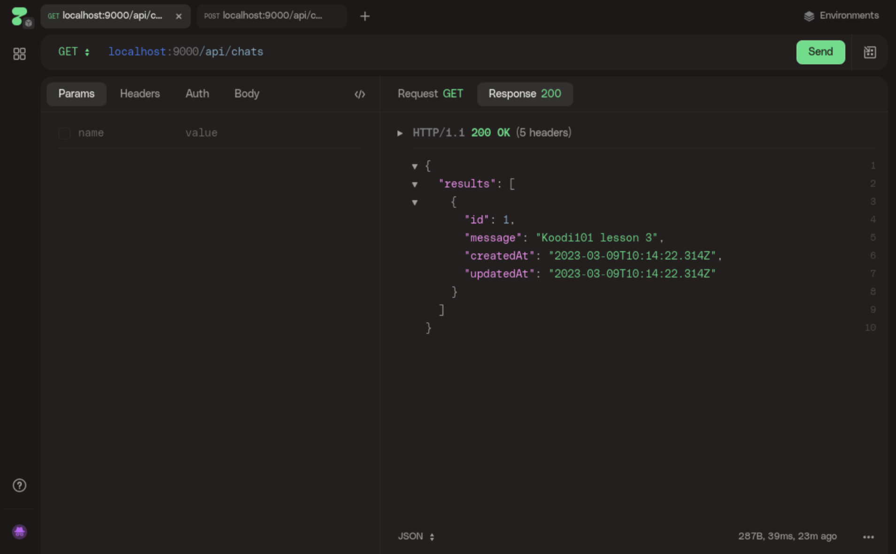

# Lesson 3: NodeJS Template

This is the repository for a simple Node.js chat application using
[koa](http://koajs.com/) (a web server framework) and [sequelize](http://docs.sequelizejs.com/), which maintains the SQLite database.

## Prerequisites

You can run the example with Node.js (or Docker).

Node.js is a programming language based on JavaScript which allows you to read files, create processes and run server software. Regular JavaScript is run within a web browser and has no access to the filesystem or processes.

To query the server we suggest using [HTTPie](https://httpie.io). Install the [HTTPie Desktop application](https://httpie.io/desktop), or go with just the command-line tool if you want.

## Running the example

After forking and cloning the repository, you have to change your _working directory_ so that Node.js can find the required files, like [`package.json`](backend/package.json) and the `src` directory.

    cd lesson3-nodejs-template

To confirm you are in the correct directory, use the command

    ls

You should now see something similar to

    $ ls
    backend  docker-compose.yml  README.md

> `cd` means change directory and `ls` is short for list.
>
> The dollar sign `$` indicates that the following text is a command executed by the shell.

### Running with plain Node.js

    npm install
    npm run dev

## Exercises

### The app

- Use [HTTPie](https://httpie.io/) to
  - Post a new message to _/api/chats_
  - Get the messages from _/api/chats_

> For more information on how to use the HTTPie CLI, refer to [the official documentation](https://httpie.io/docs/cli/examples).

### Deploy

- Use SSH keys to login to the server
- Install needed dependencies on the server
  - `node`
  - `tmux`
- Start a `tmux` session
- Run `npm start`
- (Detach `CTRL-B D` and log out `CTRL-D`)

> Note: Deploying production software services using tmux and a shell is not recommended. This guide is only for getting up to speed.

## Optional homework

- Add nickname and chat rooms to messages
- Create a new endpoint `/api/chats/<room>` that returns messages for specific room
- Commit your changes and deploy them over SSH.
